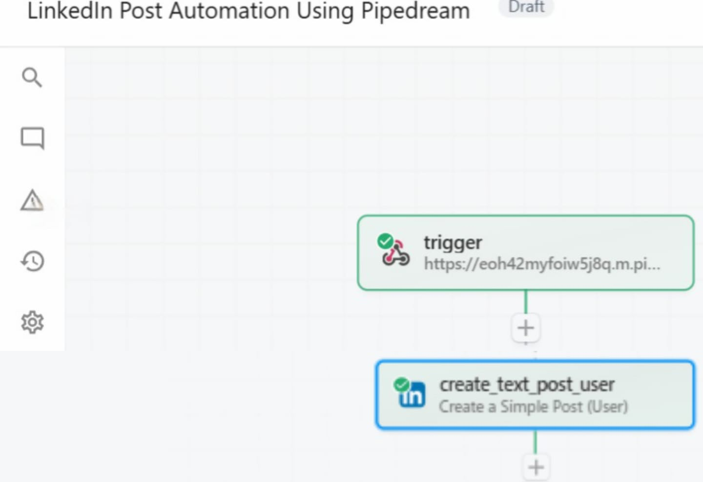
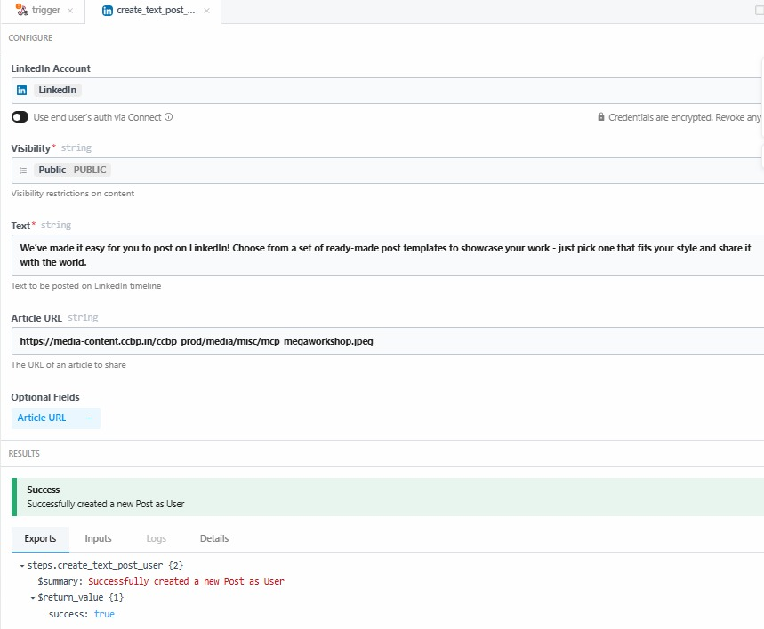
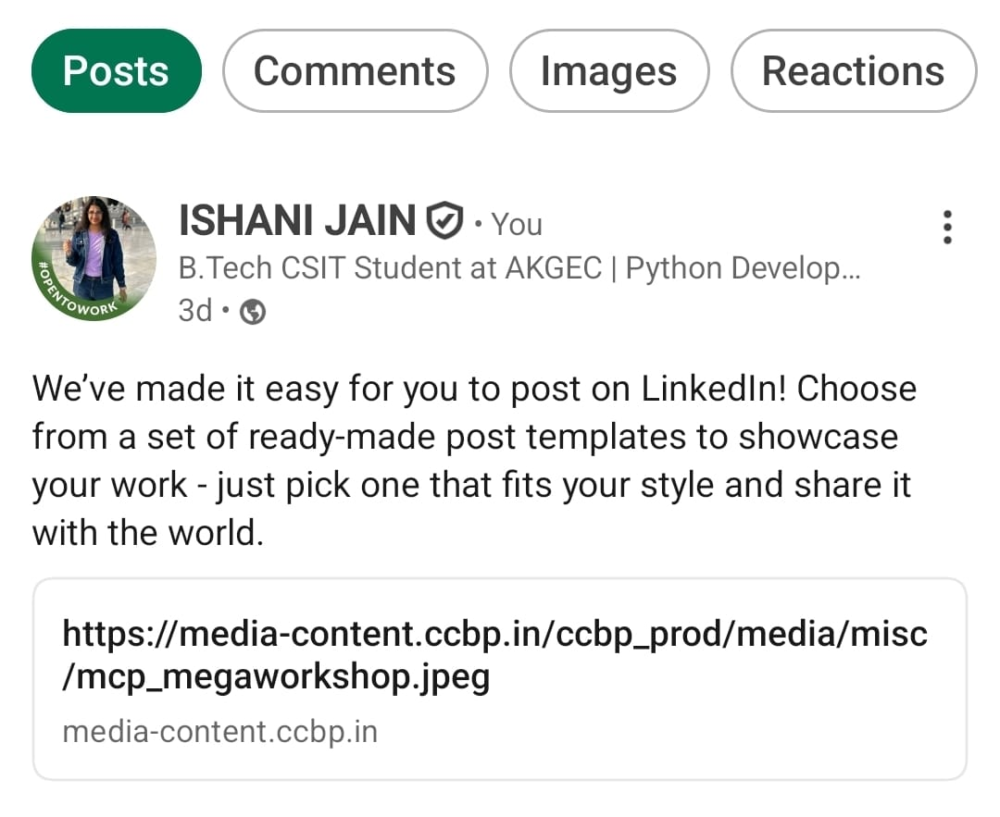
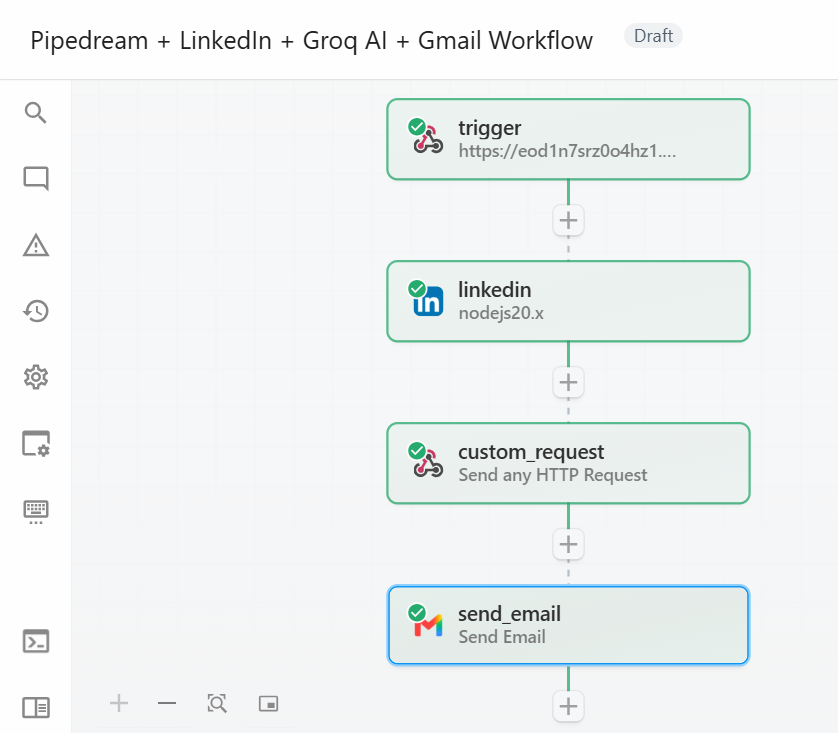
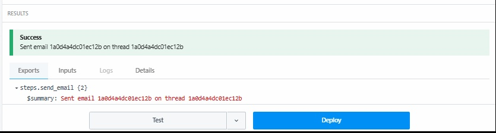
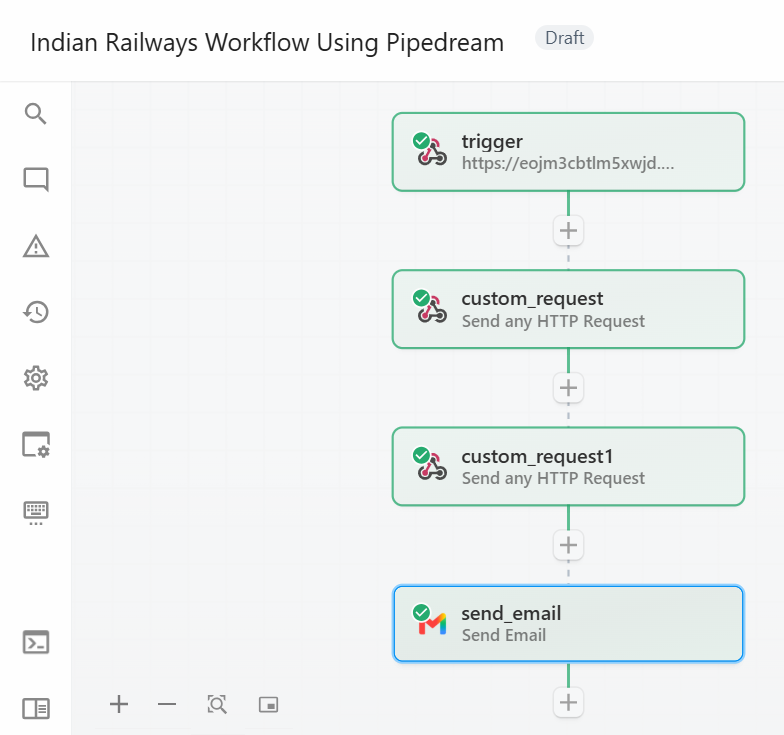
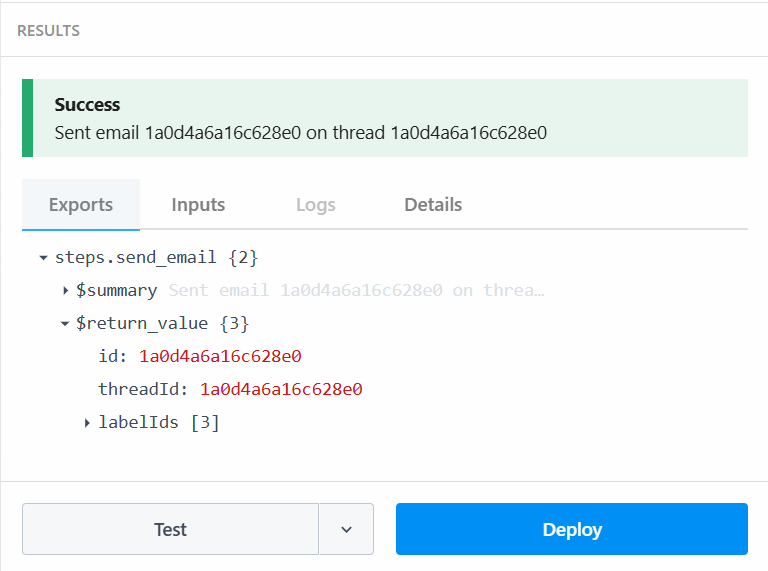

# Pipedream Workflow Automation Projects

A collection of workflow automation projects built and tested using **Pipedream**, integrating external services, APIs, webhooks, and automation logic.

## Projects

### 1. LinkedIn Post Automation Using Pipedream

A Pipedream workflow designed to create LinkedIn posts using a webhook trigger and LinkedIn integration.

**Workflow:**
HTTP Webhook → LinkedIn Post Creation

**Tools & Technologies:**
- Pipedream
- LinkedIn
- Webhooks
- Workflow Automation

**Key Learning:**
- Webhook-based triggers
- Connecting external services
- LinkedIn integration
- Event-driven workflow automation
- Testing workflow components

#### Screenshots

**Workflow**

**Successful LinkedIn Post Creation**

**Actual LinkedIn Post**

---

### 2. Pipedream + LinkedIn + Groq AI + Gmail Workflow

A multi-service automation workflow that uses LinkedIn data and Groq AI to generate an **AI-powered cover letter**, with Gmail used to deliver the generated result.

**Workflow:**
Webhook Trigger → LinkedIn → Groq AI (HTTP Request) → Gmail

**Tools & Technologies:**
- Pipedream
- LinkedIn
- Groq AI
- Gmail
- HTTP Requests
- Workflow Automation

**Key Learning:**
- Integrating multiple external services
- Working with APIs through HTTP requests
- Integrating AI into an automation workflow
- Generating AI-powered content
- Connecting workflow outputs to Gmail

#### Screenshots

**Workflow**

**Cover letter successfully sent to Gmail**

---

### 3. Indian Railways Workflow Using Pipedream

A multi-step automation workflow that retrieves Indian Railways information, generates AI-powered summaries, and delivers the results through Gmail.

**Capabilities:**
- Get train live status
- Get train schedule
- Check seat availability
- Generate AI summaries
- Send results through Gmail

**Workflow:**
Webhook Trigger → Railway API Requests → AI Processing → Gmail

**Tools & Technologies:**
- Pipedream
- APIs / HTTP Requests
- AI / Generative AI
- Gmail
- Webhooks
- Workflow Automation

**Key Learning:**
- Working with external APIs
- Building multi-step workflows
- Integrating AI into automation
- Processing and summarizing external data
- Delivering automated results through email

#### Screenshots

**Workflow**

**Results successfully sent to Gmail**

---

## Overall Learning Outcomes

Through these projects, I gained hands-on experience with:

- Workflow automation using Pipedream
- Webhook-based triggers
- API and external-service integrations
- Multi-step automation workflows
- AI-powered workflow integration
- Event-driven workflows
- Testing and debugging automation workflows

## Project Status

These projects were developed and tested during the learning process using Pipedream.

Production deployment availability may depend on the Pipedream plan and the requirements of individual workflows.
